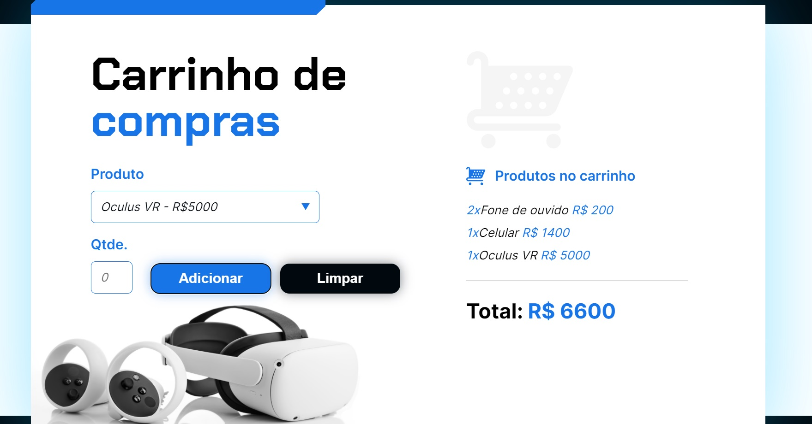

# Carrinho de compras

### Projeto
Este projeto foi desenvolvido a partir dos direcionamentos dados nas aulas do curso de formação em lógica de programação da Alura. 
O objetivo era criar um carrinho de compras que exibisse os itens escolhidos, a quantidade e o valor total do carrinho, tudo isso através da linguagem JavaScript.

### Tecnologias utilizadas durante o curso:

  

